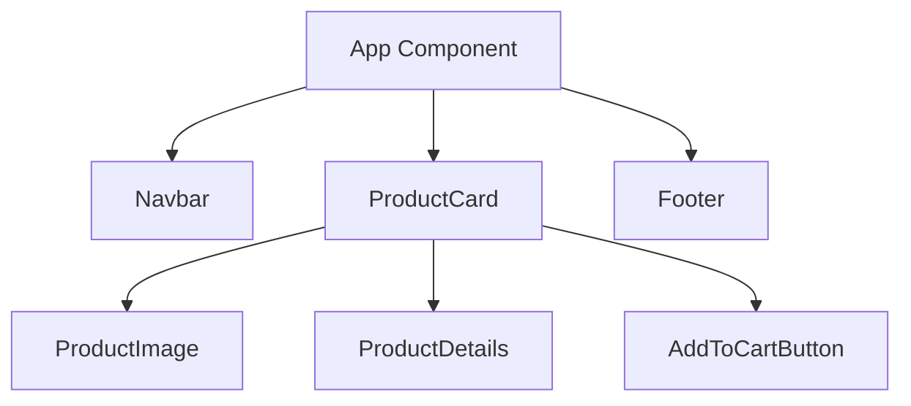

# 🧱 Components: The Building Blocks of React

## What Are Components?

Imagine components as **LEGO bricks** for your UI - independent, reusable pieces that snap together to form complete interfaces. Each component manages its own structure, appearance, and behavior.



## Why Components Matter

✔ **Reusability**: Build once, use everywhere  
✔ **Isolation**: Changes in one component don't break others  
✔ **Maintainability**: Easier to debug and update  
✔ **Composability**: Combine simple components into complex UIs

## Component Types

### 1. Functional Components (Modern)

```jsx
function WelcomeBanner({ username }) {
  return (
    <div className="welcome">
      <h1>Hello, {username}!</h1>
      <p>We're glad to see you back</p>
    </div>
  );
}
```

### 2. Class Components (Legacy)

```jsx
class WelcomeBanner extends React.Component {
  render() {
    return (
      <div className="welcome">
        <h1>Hello, {this.props.username}!</h1>
      </div>
    );
  }
}
```

## Component Anatomy

1. **Props**: Input data (immutable)
2. **State**: Internal data (mutable)
3. **Lifecycle**: Mount → Update → Unmount
4. **JSX**: Visual representation

## Creating a Component

### Step-by-Step Example

```jsx
// 1. Import React
import React from "react";

// 2. Define component
function UserCard({ name, avatar, bio }) {
  return (
    <article className="user-card">
      
      <h2>{name}</h2>
      <p>{bio}</p>
    </article>
  );
}

// 3. Export component
export default UserCard;
```

## Using Components

```jsx
import UserCard from "./UserCard";

function App() {
  return (
    <main>
      <UserCard
        name="Alice"
        avatar="/alice.jpg"
        bio="Frontend developer from Paris"
      />
      <UserCard name="Bob" avatar="/bob.jpg" bio="UX designer from London" />
    </main>
  );
}
```

## Real-World Analogy

Think of components like **professional kitchen stations**:

- **Salad Station**: Handles all salads (props = ingredients)
- **Grill Station**: Manages its own cooking (state = temperature)
- **Expo Station**: Combines everything (composition)
- Each can be upgraded independently

---

> 💡 **Did You Know?** Facebook's codebase has over 50,000 React components!

---
