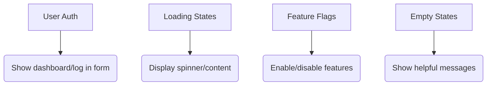

# 🌓 Conditional Rendering in React

## What is Conditional Rendering?

Conditional rendering is like a **smart traffic light** for your UI - it shows different content based on your application's state. This powerful pattern lets you create dynamic interfaces that respond to user interactions, data changes, and system states.

## Why Use Conditional Rendering?

✔ **Dynamic UIs**: Show/hide elements based on state  
✔ **User Experience**: Display relevant content  
✔ **Performance**: Avoid rendering unnecessary components  
✔ **Clean Code**: Keep logic organized

## 5 Ways to Implement Conditional Rendering

### 1. If/Else Statements (Basic)

```jsx
function AuthMessage({ isLoggedIn }) {
  if (isLoggedIn) {
    return <h1 className="welcome">Welcome back!</h1>;
  } else {
    return <h1 className="alert">Please sign in</h1>;
  }
}
```

### 2. Ternary Operator (Inline)

```jsx
function AuthButton({ isLoggedIn }) {
  return <button>{isLoggedIn ? "Log Out" : "Log In"}</button>;
}
```

### 3. Logical && Operator (Short Circuit)

```jsx
function Notification({ messageCount }) {
  return (
    <div>
      <h2>Notifications</h2>
      {messageCount > 0 && <p>You have {messageCount} new messages</p>}
    </div>
  );
}
```

### 4. Switch Statements (Multiple Conditions)

```jsx
function StatusIndicator({ status }) {
  switch (status) {
    case "loading":
      return <Spinner />;
    case "error":
      return <ErrorAlert />;
    case "success":
      return <SuccessMessage />;
    default:
      return <InfoPanel />;
  }
}
```

### 5. Immediately Invoked Functions (Complex Logic)

```jsx
function ComplexRenderer({ data, isLoading, error }) {
  return (
    <div>
      {(() => {
        if (error) return <ErrorDisplay />;
        if (isLoading) return <Loader />;
        if (data.length === 0) return <EmptyState />;
        return <DataList items={data} />;
      })()}
    </div>
  );
}
```

## Common Use Cases



## Best Practices

1. **Keep conditions simple** - Extract complex logic to separate functions
2. **Avoid nesting ternaries** - Use if/else or switch for multiple conditions
3. **Use early returns** - Cleaner than wrapping entire components
4. **Memoize expensive operations** - Use `useMemo` for heavy computations
5. **Consider component extraction** - When branches become too large

## Knowledge Check Answers

**Q:** What are two different ways to implement conditional rendering in React?  
**A:**

1. **If/Else Statements** - Traditional JavaScript conditionals that return different JSX
2. **Ternary Operator** - Compact inline condition `condition ? trueJSX : falseJSX`

**Bonus Answers:**  
3. **Logical && Operator** - Shows content only when condition is truthy  
4. **Switch Statements** - Clean way to handle multiple conditions  
5. **Immediately Invoked Functions** - For complex conditional logic

---

> 💡 **Pro Tip:** Use React DevTools to see which conditional branches are rendering in real-time!

---
