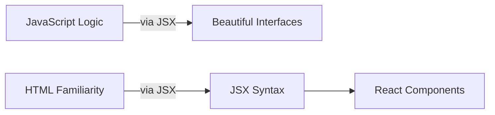

# ✨ JSX: JavaScript + HTML Superpowers

## What is JSX?

JSX is like a **magic bridge** between JavaScript and HTML. It's a special syntax that lets you write HTML-like code directly in your JavaScript files, making React components incredibly intuitive to create and maintain.



## Why JSX Rocks

✔ **Visual Clarity**: See your component's structure at a glance  
✔ **Full JavaScript Power**: Embed logic right in your markup  
✔ **Component Composition**: Easily nest components like HTML tags  
✔ **Error Prevention**: Catch mistakes early with compile-time checks

## Your First JSX Component

```jsx
// WelcomeBanner.jsx
function WelcomeBanner({ username }) {
  return (
    <div className="banner">
      <h1>Hello, {username}!</h1>
      <p>Welcome back to your dashboard</p>
      <Button>Continue</Button>
    </div>
  );
}
```

### Key Features Shown:

- HTML-like syntax (`<div>`, `<h1>`)
- JavaScript expressions (`{username}`)
- Component nesting (`<Button>`)
- CSS classes (`className`)

## Behind the Scenes

JSX gets transformed into regular JavaScript:

```jsx
// What you write:
<div className="alert">Hello {name}!</div>;

// What browsers see:
React.createElement("div", { className: "alert" }, "Hello ", name, "!");
```

## Example JSX vs HTML +JS

### 🧱 Régi módszer: `document.createElement`, `appendChild`, stb.

```js
const root = document.getElementById("root");

const container = document.createElement("div");

const heading = document.createElement("h1");
heading.textContent = "Hello, world!";
container.appendChild(heading);

const button = document.createElement("button");
button.textContent = "Click me!";
button.addEventListener("click", () => {
  alert("Button clicked!");
});
container.appendChild(button);

root.appendChild(container);
```

---

### ⚛️ Modern React + JSX megközelítés:

```jsx
import React from "react";
import ReactDOM from "react-dom/client";

const App = () => (
  <div>
    <h1>Hello, world!</h1>
    <button onClick={() => alert("Button clicked!")}>Click me!</button>
  </div>
);

const root = ReactDOM.createRoot(document.getElementById("root"));
root.render(<App />);
```

---

### 💡 Mit érdemes kiemelni a tanulóknak?

- **JSX tisztább, rövidebb, olvashatóbb.**
- Nem kell minden elemet külön `createElement`-el létrehozni.
- Nem kell `appendChild`-ozni.
- Az eseménykezelés (`onClick`) is sokkal tisztább.
- **A JSX közelebb áll a HTML-hez**, így könnyebb tanulni.

---

## Pro Tips

1. Always **close tags** (`<br />` not `<br>`)
2. Use **className** instead of class
3. **CamelCase** DOM properties (`onClick` not `onclick`)
4. **One parent element** per component return
5. **Comments** need curly braces: `{/* Like this */}`

---

> 💡 **Did You Know?** JSX was inspired by XHP, a PHP extension Facebook created to build safer web interfaces!

---
