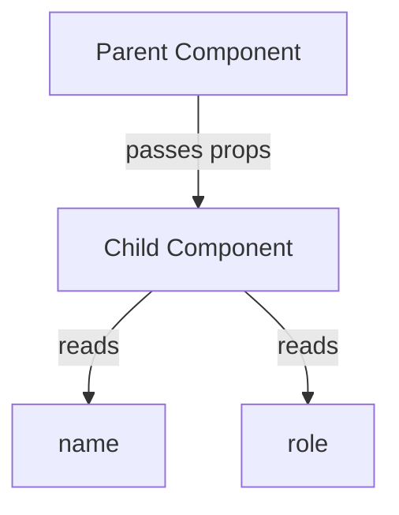

# 📦 Props: Component Communication in React

## What Are Props?

Props (short for properties) are like **configuration settings** you pass to components — similar to arguments in functions. They enable **parent-to-child** communication in React's one-way data flow.



## Key Characteristics

🔒 **Immutable** – Children can't modify them
📤 **One-Way** – Data flows from parent to child only
🎨 **Customizable** – Tailor components to different uses
🔍 **Type-Checkable** – Validate with PropTypes or TypeScript

---

## Basic Usage

### 🧩 Parent Component (Sender)

```jsx
function UserDashboard() {
  return (
    <div>
      <UserProfile name="Alice" role="Developer" joinDate="2020-05-15" />
    </div>
  );
}
```

### 🧱 Child Component (Receiver)

```jsx
function UserProfile(props) {
  return (
    <div className="profile">
      <h2>{props.name}</h2>
      <p>Role: {props.role}</p>
      <p>Member since: {props.joinDate}</p>
    </div>
  );
}
```

---

## 💡 Modern Destructuring

Cleaner way to access props inside the component:

```jsx
function UserProfile({ name, role, joinDate }) {
  return (
    <div className="profile">
      <h2>{name}</h2>
      <p>Role: {role}</p>
      <p>Member since: {joinDate}</p>
    </div>
  );
}
```

---

## 🔧 Advanced Prop Patterns

### 1. Default Props

```jsx
UserProfile.defaultProps = {
  role: "Guest",
  joinDate: new Date().toISOString(),
};
```

### 2. `children` Prop

```jsx
function Card({ children }) {
  return <div className="card">{children}</div>;
}

// Usage:
<Card>
  <h3>Content goes here!</h3>
</Card>;
```

---

## ⚖ Props vs State

| Feature    | Props            | State          |
| ---------- | ---------------- | -------------- |
| Mutability | Immutable        | Mutable        |
| Ownership  | Parent Component | Same Component |
| Flow       | Parent → Child   | Internal Only  |
| Updates    | On re-render     | setState()     |

---

## 🧪 Real-World Analogy

Think of props like **ingredients** passed to a recipe (component):

- The chef (parent) prepares the ingredients (props)
- The recipe (child) uses them to cook the dish
- The recipe can’t change the original ingredients
- Want a different result? Change the ingredients!

---

> 💡 **Pro Tip**: Use the React DevTools browser extension to explore props in your component tree and debug faster.

---
