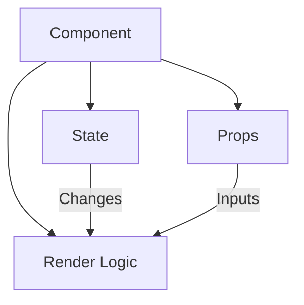

# ⚛️ Welcome to React.js

## 🌟 What is React?

React is like **LEGO® for web interfaces** - a JavaScript library that lets you build dynamic user interfaces by snapping together reusable components. Created by Facebook and released in 2013, it powers some of the world's most popular apps including:

- Facebook (including Instagram)
- Airbnb
- Netflix
- WhatsApp Web

## 🧩 Core Philosophy

React transforms UI development with three key ideas:

1. **Component Architecture**  
   Build self-contained pieces that manage their own appearance and behavior

2. **Declarative Style**  
   Describe _what_ your UI should look like (not how to build it step-by-step)

3. **Efficient Updates**  
   Smart "diffing" algorithms update only what changed

## 🚀 Why Developers Love React

- **Reusability**: Build once, use everywhere
- **Performance**: Virtual DOM minimizes slow browser operations
- **Ecosystem**: Rich community tools (Next.js, Gatsby, etc.)
- **Flexibility**: Works with other libraries/frameworks

> 💡 **Fun Fact**: React was originally created because Facebook needed a better way to handle constant updates in their news feed!

---
