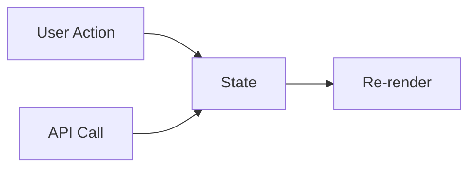

# 🎛️ State Management in React

## What is State?

State is like a **component's memory** - it stores dynamic data that can change over time and triggers re-renders when updated. Unlike props (which are passed down), state is managed internally by the component.



## Why State Matters

✔ **Dynamic UIs**: Enable interactive experiences  
✔ **Data Persistence**: Remember values between renders  
✔ **Reactivity**: Automatically update the UI when data changes  
✔ **Local Management**: Handle component-specific data

## The `useState` Hook

### Basic Usage

```jsx
import { useState } from "react";

function Counter() {
  const [count, setCount] = useState(0); // Initialize with 0

  return (
    <div>
      <p>You clicked {count} times</p>
      <button onClick={() => setCount(count + 1)}>Click me</button>
    </div>
  );
}
```

## 🧠 Virtual DOM vs Real DOM (short explanation)

### 🧾 What is the **Real DOM**?

The **Real DOM** is the actual Document Object Model that the **browser renders** on the screen (HTML). It’s what users see and interact with.

---

### 🧠 What is the **Virtual DOM**?

The **Virtual DOM** is a lightweight **copy of the UI** stored in memory by React.
It’s used to **track changes** before updating the Real DOM.

---

### 🔁 What happens when state changes?

1. You call a state updater (e.g., `setCount(5)`).
2. React creates a **new Virtual DOM** version.
3. It compares it to the previous Virtual DOM (diffing).
4. It finds the minimal set of changes.
5. Then it **updates the Real DOM efficiently**, avoiding unnecessary changes.

---

### 📘 Quick Summary Table

| Concept     | Description                              |
| ----------- | ---------------------------------------- |
| Real DOM    | The actual DOM in the browser            |
| Virtual DOM | A copy React uses to track changes       |
| Why use it? | Better performance via efficient updates |

### How It Works:

1. **Initialization**: `useState(initialValue)` sets starting state
2. **Destructuring**: Returns `[currentValue, setterFunction]`
3. **Updating**: Call setter function to change state
4. **Re-rendering**: React automatically updates the UI

## Key Characteristics

🔁 **Asynchronous Updates**: State changes don't happen immediately  
🔄 **Batched Updates**: Multiple setters may combine into one render  
🧊 **Persists Between Renders**: State isn't reset unless you change it  
🚫 **Never Modify Directly**: Always use the setter function

## Multiple State Variables

```jsx
function Form() {
  const [name, setName] = useState("");
  const [email, setEmail] = useState("");
  const [isSubscribed, setIsSubscribed] = useState(true);

  return (
    <form>
      <input value={name} onChange={(e) => setName(e.target.value)} />
      {/* ...other fields... */}
    </form>
  );
}
```

## State vs Props

| Feature    | State            | Props              |
| ---------- | ---------------- | ------------------ |
| Ownership  | Component itself | Parent component   |
| Mutability | Can be changed   | Read-only          |
| Scope      | Internal         | Passed downward    |
| Purpose    | Track changes    | Configure behavior |

## Advanced Patterns

### 1. Functional Updates

```jsx
setCount((prevCount) => prevCount + 1);
```

Use when new state depends on previous state

### 2. Object State

```jsx
const [user, setUser] = useState({
  name: "",
  email: "",
  preferences: {},
});

// Update with spread operator
setUser((prev) => ({ ...prev, name: "Alice" }));
```

### 3. Initialization Function

```jsx
// Expensive computation runs only once
const [data] = useState(() => calculateInitialValue());
```

## Common Mistakes with useState in React

Sure! Here’s a concise English chapter on **Common Mistakes with `useState` in React**, including bad examples and explanations:

### 1. ❌ Directly mutating state

```jsx
const [count, setCount] = useState(0);

// ❌ This won't work as expected:
count = count + 1; // Direct mutation — React won't detect this change
```

**Why?**
React only re-renders when you use the setter function (`setCount`), not when you directly change the variable.

---

### 2. ❌ Using stale state when updating multiple times

```jsx
const [count, setCount] = useState(0);

function incrementTwice() {
  setCount(count + 1);
  setCount(count + 1);
}
```

**What happens?**
Both calls use the same old `count` value, so the state increases by 1 instead of 2.

---

### ✅ Correct way: use functional updates

```jsx
function incrementTwice() {
  setCount((prev) => prev + 1);
  setCount((prev) => prev + 1);
}
```

This ensures each update uses the latest state value.

---

### 3. ❌ Assuming state updates are immediate

```jsx
function resetAndIncrement() {
  setCount(0);
  setCount(count + 1); // This still uses the old `count` value!
}
```

**What actually happens?**
React batches updates, so the final state will be `count + 1` (old value + 1), not 1.

---

### How to fix it?

- If you want to reset to 0 and then increment, do it in one step:

```jsx
setCount(1);
```

- Or separate with a delay (not recommended but possible):

```jsx
setCount(0);
setTimeout(() => setCount((prev) => prev + 1), 0);
```

---

**Summary:**

- Never mutate state directly.
- Use functional updates when updating state multiple times in a row.
- Remember that state updates are asynchronous and batched.

---

## Knowledge Check Answer

**Q:** How does `useState` work in React?  
**A:**  
The `useState` hook:

1. Takes an initial state value as argument
2. Returns an array with `[currentState, setterFunction]`
3. When the setter is called:
   - Updates the state value
   - Triggers a re-render of the component
   - Preserves the state between renders

Its role is to:  
✔ Add state management to functional components  
✔ Handle dynamic data that changes over time  
✔ Automatically update the UI when state changes

---
